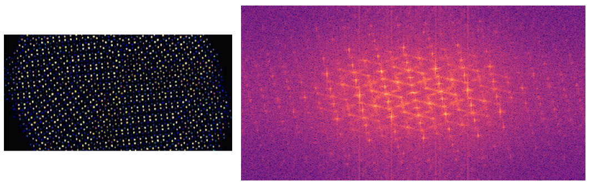

# Transformada-Fourier-Images

Es un jupyter muy sencillo para ver las transformadas de fourier de imagenes, Sería más o menos análogo a ver el patrón de difracción de una cierta estructura

Hay varios ejemplos de imagenes de Internet, puedes añadir más solo con poner una linea más en la celda correspondiente:

```py
p.append(['url'])
```

luego en la celda de furieriza seleccionas el índice que quieres ver.

Un ejemplo es el siguiente


